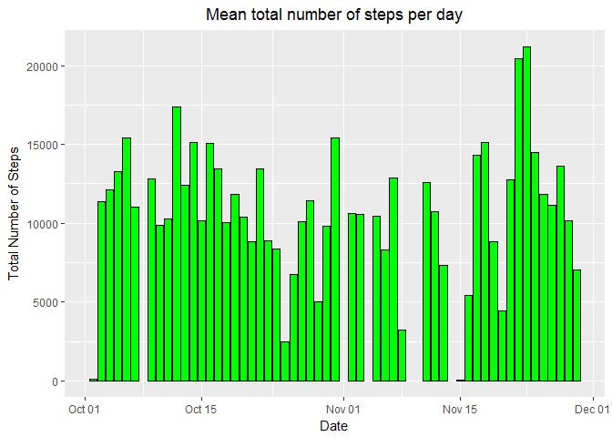
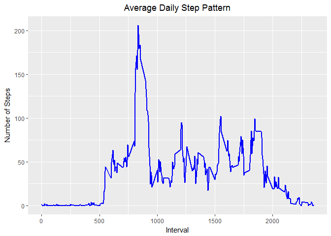
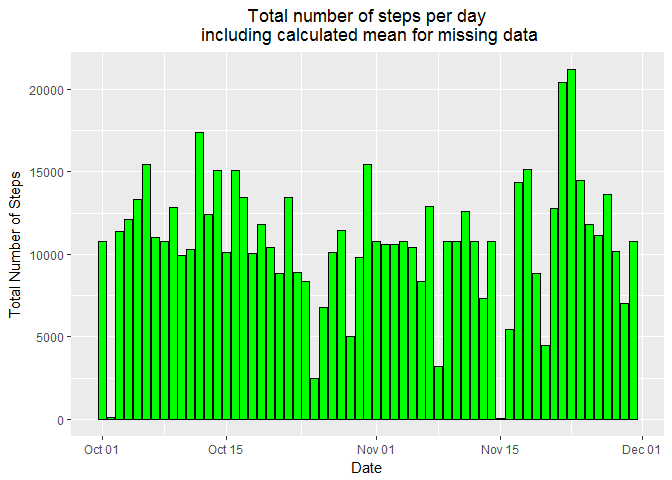
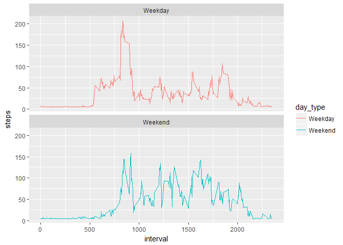

# Reproducible Research: Peer Assessment 1
Shawne A. Pierson  
March 5, 2017  
###About
This assignment makes use of data from a personal activity monitoring device. This device collects data at 5 minute intervals through out the day. The data consists of two months of data from an anonymous individual collected during the months of October and November, 2012 and include the number of steps taken in 5 minute intervals each day.

## Setting Environmentals and loading packages

```r
library(knitr)
opts_chunk$set(echo = TRUE)
library(dplyr)
```

```
## 
## Attaching package: 'dplyr'
```

```
## The following objects are masked from 'package:stats':
## 
##     filter, lag
```

```
## The following objects are masked from 'package:base':
## 
##     intersect, setdiff, setequal, union
```

```r
library(lubridate)
```

```
## 
## Attaching package: 'lubridate'
```

```
## The following object is masked from 'package:base':
## 
##     date
```

```r
library(ggplot2)
```

## Loading and preprocessing the data

```r
    # Clean up workspace
    rm(list=ls())
    
    # Setup working directory and files
    main_dir <- "C:/Users/maxim/Documents/Coursera/Reproducible Research/Assignment1/RepData_PeerAssessment1"
    targetFileName <- c("./activity.zip")                            # Download file name
    source_file1 <- "activity.csv"
    
    setwd(main_dir)
    
    # If our source_file1 file does not exist, then unzip the targetFileName
    if (!(file.exists(source_file1))) {
        unzip(targetFileName)
    }
    
    # Read csv file
    activity_df <- read.csv(source_file1, header = TRUE, sep = ',',
                            colClasses = c("numeric", "character", "integer"))
    
    # Process data frame for usage
    activity_df$date <- ymd(activity_df$date)
    activity_df <- data.frame(date=activity_df$date, 
                    steps=activity_df$steps,
                    interval=activity_df$interval,
                    weekday=tolower(weekdays(activity_df$date)))
    
    # Determine the day type of either weekend or weekday based upon the value of weekday
    activity_df <- cbind(activity_df, 
                    day_type=ifelse(activity_df$weekday == "saturday" | activity_df$weekday == "sunday",
                    "Weekend", "Weekday"))
    
    # Create my final working data.frame for reporting and graph purposes
    activities <- data.frame(date=activity_df$date,
                    steps=activity_df$steps,
                    interval=activity_df$interval,
                    weekday=activity_df$weekday,
                    day_type=activity_df$day_type)
    
    # Tidy up my environment
    rm(activity_df)
```

# Validate my data frame makes sense

```r
    head(activities)
```

```
##         date steps interval weekday day_type
## 1 2012-10-01    NA        0  monday  Weekday
## 2 2012-10-01    NA        5  monday  Weekday
## 3 2012-10-01    NA       10  monday  Weekday
## 4 2012-10-01    NA       15  monday  Weekday
## 5 2012-10-01    NA       20  monday  Weekday
## 6 2012-10-01    NA       25  monday  Weekday
```

```r
    str(activities)
```

```
## 'data.frame':	17568 obs. of  5 variables:
##  $ date    : Date, format: "2012-10-01" "2012-10-01" ...
##  $ steps   : num  NA NA NA NA NA NA NA NA NA NA ...
##  $ interval: int  0 5 10 15 20 25 30 35 40 45 ...
##  $ weekday : Factor w/ 7 levels "friday","monday",..: 2 2 2 2 2 2 2 2 2 2 ...
##  $ day_type: Factor w/ 2 levels "Weekday","Weekend": 1 1 1 1 1 1 1 1 1 1 ...
```
## What is mean total number of steps taken per day?

```r
    # 1. Make a histogram of the total number of steps taken each day
    plot_hist <- ggplot(data = na.omit(activities), aes(date, steps)) + 
        stat_summary(fun.y = sum, geom = "bar", fill = 'green', col = "black") +
        labs(title="Mean total number of steps per day", x="Date", y="Total Number of Steps") +
        theme(plot.title = element_text(hjust = 0.5))
    plot_hist
```

<!-- -->

```r
    # 2. Calculate and report the mean and median total number of steps taken per day
    total_steps_per_day <- with(activities, tapply(steps, date, sum, na.rm = TRUE))
    total_steps_per_day_mean <- mean(total_steps_per_day)
    total_steps_per_day_median <- median(total_steps_per_day)
```

**The mean number of steps taken per day is 9354.23**

**The median number of steps taken per day is 10395.00**

## What is the average daily activity pattern?

```r
    # Generate the number of steps per interval
    steps_per_interval <- aggregate(activities$steps, 
                                    by = list(interval = activities$interval),
                                    FUN=mean, na.rm=TRUE)

    # Set column names
    colnames(steps_per_interval) <- c("interval", "steps")
    
    # 1. Make a time series plot (i.e. type = "l") of the 5-minute interval (x-axis)
    #    and the average number of steps taken, averaged across all days (y-axis)
    plot_time <- ggplot(steps_per_interval, aes(x=interval, y=steps))  +   
        geom_line(color="blue", size=1) +  
        labs(title="Average Daily Step Pattern", x="Interval", y="Number of Steps") +
        theme(plot.title = element_text(hjust = 0.5))

    plot_time
```

<!-- -->

```r
    # 2. Which 5-minute interval, on average across all the days in the dataset, contains the maximum
    #    number of steps?
    max_interval <- steps_per_interval[which.max(steps_per_interval$steps),]
```
**The 5 minute interval with the maximum number of steps is 835
    with 206.17 steps.**

## Imputing missing values

```r
    # 1. Calculate and report the total number of missing values in the dataset
    #    (i.e. the total number of rows with NAs)
    num_missing_rows <- sum(is.na(activities))
```
**The number of missing values in the dataset (i.e. the total number of rows with NAs) is 2304.00.**


```r
    # 2. Devise a strategy for filling in all of the missing values in the dataset. The strategy does not
    #    need to be sophisticated. For example, you could use the mean/median for that day, or the mean for
    #    that 5-minute interval, etc.
    #    My approach is to calculate the mean and set the NA values to the new calculated mean.

    # 3. Create a new dataset that is equal to the original dataset but with the missing data filled in.

    # Copy the activities data.frame
    activities_without_NAs <- cbind(activities)

    # Find the location of the NA values
    na_locations <- which(is.na(activities_without_NAs$steps))

    # Determine the means and replicate the elements based upon the length of na_locations
    calculated_means <- rep(mean(activities_without_NAs$steps, na.rm=TRUE), times=length(na_locations))
    
    # Replace the NA's with my calculated means
    activities_without_NAs[na_locations, "steps"] <- calculated_means
    
    # Let's make sure we have an updated data.frame to work with that does not contain NA's
    head(activities_without_NAs)
```

```
##         date   steps interval weekday day_type
## 1 2012-10-01 37.3826        0  monday  Weekday
## 2 2012-10-01 37.3826        5  monday  Weekday
## 3 2012-10-01 37.3826       10  monday  Weekday
## 4 2012-10-01 37.3826       15  monday  Weekday
## 5 2012-10-01 37.3826       20  monday  Weekday
## 6 2012-10-01 37.3826       25  monday  Weekday
```

```r
    tail(activities_without_NAs)
```

```
##             date   steps interval weekday day_type
## 17563 2012-11-30 37.3826     2330  friday  Weekday
## 17564 2012-11-30 37.3826     2335  friday  Weekday
## 17565 2012-11-30 37.3826     2340  friday  Weekday
## 17566 2012-11-30 37.3826     2345  friday  Weekday
## 17567 2012-11-30 37.3826     2350  friday  Weekday
## 17568 2012-11-30 37.3826     2355  friday  Weekday
```

```r
    # 4a. Make a histogram of the total number of steps taken each day
    plot_hist2 <- ggplot(data = activities_without_NAs, aes(date, steps)) + 
        stat_summary(fun.y = sum, geom = "bar", fill = 'green', col = "black") +
        labs(title="Total number of steps per day\n including calculated mean for missing data",
             x="Date", y="Total Number of Steps") +
        theme(plot.title = element_text(hjust = 0.5))
    plot_hist2
```

<!-- -->

```r
    # 4b. Calculate and report the mean and median total number of steps taken per day using calculated mean
    #     for missing data.
    total_steps_per_day_imputing <- with(activities_without_NAs, tapply(steps, date, sum, na.rm = TRUE))
    total_steps_per_day_mean_imputing <- mean(total_steps_per_day_imputing)
    total_steps_per_day_median_imputing <- median(total_steps_per_day_imputing)
```
**The mean number of steps taken per day including (imputing) is 10766.19**

**The median number of steps taken per day including (imputing) is 10766.19**

**Do these values differ from the estimates from the first part of the assignment?**
***(YES)***

**What is the impact of imputing missing data on the estimates of the total daily number of steps?**
***(The impact of imputing the missing data generates data for calculations.  Therefore, our results will reflect a larger mean and median value.)***

## Are there differences in activity patterns between weekdays and weekends?


```r
    activities_by_interval <- activities_without_NAs %>%
        group_by(interval, day_type) %>%
        summarise(steps = mean(steps))

    plot_time2 <- ggplot(activities_by_interval, aes(x=interval, y=steps, color = day_type)) +
                    geom_line() +
                    facet_wrap(~day_type, ncol = 1, nrow=2)
    plot_time2
```

<!-- -->


**Are there differences in activity patterns between weekdays and weekends?**
***(YES)***
